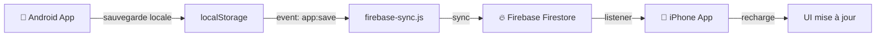

# 🎯 Synchronisation Android ↔ iPhone : Guide Rapide

## Ce qui a été fait pour vous ✅

1. **Firebase Sync amélioré** : Synchronisation bidirectionnelle en temps réel
2. **Capacitor configuré** : Prêt pour iOS et Android
3. **Package.json mis à jour** : Scripts de build inclus
4. **Guides créés** : Tout expliqué étape par étape

---

## 🚀 Démarrage en 5 minutes

### Sur Android (l'app de l'utilisateur)

```
1. Ouvrir l'app Android
2. Se connecter : Email + Mot de passe
3. Ajouter des produits à la liste
4. Laisser l'app ouverte (sync en arrière-plan)
```

### Sur iPhone (votre app)

**Option 1 : PWA (Plus simple) ⭐**
```
1. npm run build                    # Compilez l'app
2. Uploadez sur Netlify/Vercel      # Mettez en ligne
3. Safari → Partage → Sur écran accueil
4. Se connecter avec le MÊME email
5. ✅ Synchronisation automatique!
```

**Option 2 : App Native (Plus compliqué)**
```
1. Compte Ionic AppFlow gratuit
2. npm run build:ios
3. AppFlow crée le .ipa automatiquement
4. AltStore ou TestFlight pour installer
```

---

## 📊 Comment ça fonctionne



---

## 🔑 Points importants

| Aspect | Détail |
|--------|--------|
| **Authentification** | Email/Mot de passe identiques sur les 2 apps |
| **Stockage cloud** | `/users/{uid}` dans Firestore |
| **Sync** | Timestamp-based (le plus récent gagne) |
| **Hors ligne** | Works, synced au reconnexion |
| **Confidentialité** | Chaque utilisateur voit que ses données |

---

## 📁 Structure du projet

```
Auchon/
├── www/                          # App web compilée
│   ├── index.html               # Page principale
│   ├── app.js                   # Logique de l'app
│   ├── styles.css               # Styling
│   ├── firebase-config.js        # Config Firebase (apiKey etc)
│   └── firebase-sync.js          # ✅ Nouveau! Sync amélioré
├── android/                      # App Android (Capacitor)
├── capacitor.config.json        # ✅ Configuré pour iOS & Android
├── package.json                 # ✅ Scripts de build
├── GUIDE_SYNC_MULTIPLATEFORME.md # 👈 Lisez ça en premier!
└── GUIDE_IOS_NATIF.md            # Pour app native iOS
```

---

## 🎓 Guides disponibles

1. **GUIDE_SYNC_MULTIPLATEFORME.md** ⭐
   - Comment mettre en ligne rapidement
   - PWA vs App Native
   - Dépannage

2. **GUIDE_IOS_NATIF.md**
   - Build iOS avec Capacitor
   - AppFlow setup
   - AltStore installation

---

## 📝 Next steps

1. **Testez la synchronisation localement**
   ```powershell
   npm install
   npm run build
   ```

2. **Mettez en ligne sur Netlify**
   - Suivez le guide principal

3. **Testez sur iPhone & Android**
   - Même email sur les 2
   - Modifiez quelque chose
   - Vérifiez que ça se synchro!

---

## ⚠️ Dépannage rapide

| Problème | Solution |
|----------|----------|
| Rien ne se synchro | Même email sur les 2 apps |
| "Permission denied" | Vérifiez règles Firebase |
| Données pas chargées | Attendez 2-3 sec, rechargez |
| Build iOS échoue | Utilisez AppFlow (cloud) |

---

## 🆘 Questions?

Consultez les guides complets :
- 📖 [GUIDE_SYNC_MULTIPLATEFORME.md](./GUIDE_SYNC_MULTIPLATEFORME.md)
- 📖 [GUIDE_IOS_NATIF.md](./GUIDE_IOS_NATIF.md)

---

**Prêt?** → Ouvrez `GUIDE_SYNC_MULTIPLATEFORME.md` maintenant! 🚀
